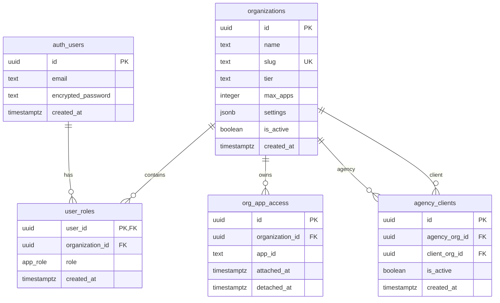
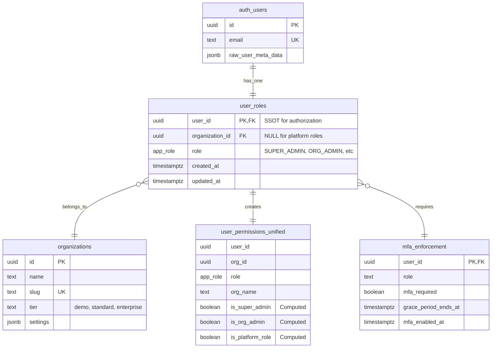
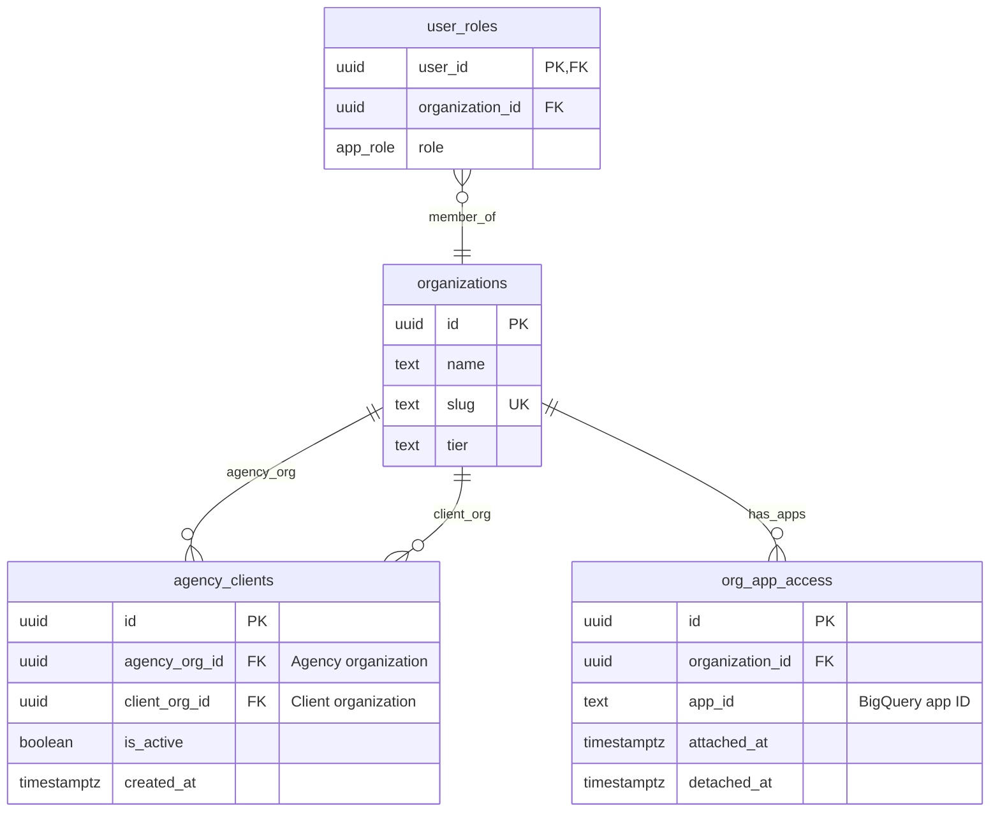
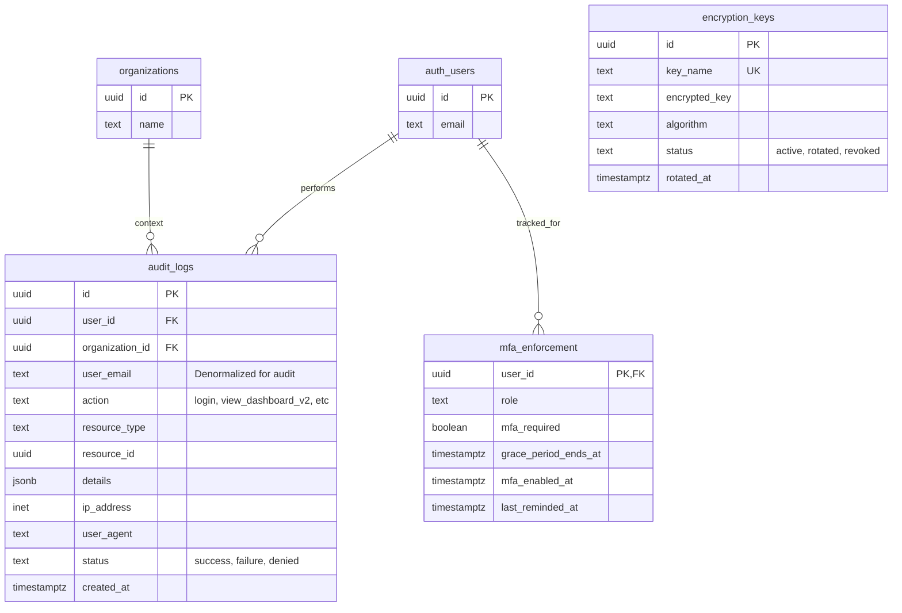
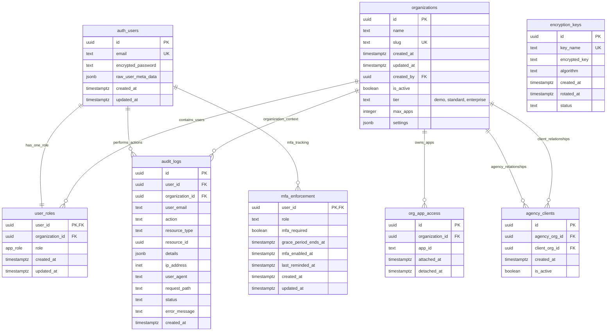

# Entity-Relationship Diagrams

Visual representation of database relationships using Mermaid ERD diagrams.

## Table of Contents

1. [Core Database Architecture](#core-database-architecture)
2. [Authorization System](#authorization-system)
3. [Multi-Tenant Agency Model](#multi-tenant-agency-model)
4. [Audit and Compliance](#audit-and-compliance)
5. [Complete Schema Diagram](#complete-schema-diagram)

---

## Core Database Architecture

This diagram shows the core tables and their primary relationships.



**Key Relationships:**
- Each user has ONE role record (via `user_roles.user_id` PK)
- Each organization can have MANY users
- Each organization can have MANY apps (via `org_app_access`)
- Organizations can have agency relationships (via `agency_clients`)

---

## Authorization System

Detailed view of the authorization and permission system.



**Authorization Flow:**
1. User authenticates → `auth.users` record created
2. Admin assigns role → `user_roles` record created
3. Frontend queries → `user_permissions_unified` view
4. RLS policies check → `sec.is_super_admin()` or direct table lookups

**Role Hierarchy:**
```
SUPER_ADMIN (platform-level, org_id = NULL)
    └─> ORG_ADMIN (organization-level)
        └─> ASO_MANAGER
            └─> ANALYST
                └─> VIEWER
                    └─> CLIENT
```

---

## Multi-Tenant Agency Model

Shows how agencies access client organization data.



**Agency Access Model:**

```
Yodel Mobile (Agency)
├─ User: admin@yodelmobile.com (ORG_ADMIN)
│
├─ Client 1 Organization
│  └─ Apps: Mixbook, ColorJoy, PhotoAffections (23 apps)
│
├─ Client 2 Organization
│  └─ Apps: AppA, AppB (5 apps)
│
└─ Client 3 Organization
   └─ Apps: AppC, AppD (2 apps)

Total Accessible: 30 apps
```

**Access Rules:**
- Agency ORG_ADMIN users can access ALL client data
- RLS policies expand query scope via `agency_clients` JOIN
- `can_access_organization()` function handles permission checks

---

## Audit and Compliance

Audit logging and compliance tracking tables.



**Audit Trail:**
- **Immutable logs** - INSERT-only table
- **7-year retention** - Compliance requirement (SOC 2, ISO 27001, GDPR)
- **Denormalized data** - `user_email` stored for audit integrity

**MFA Enforcement:**
- **30-day grace period** for admin users
- **Tracked in `mfa_enforcement`** table
- **Grace period reminders** sent weekly

---

## Complete Schema Diagram

Full database schema with all relationships.



---

## ASCII ERD Diagram (Text-Based)

For documentation that doesn't support Mermaid rendering:

```
┌─────────────────────────────────────────────────────────────────────┐
│                   CORE DATABASE ARCHITECTURE                        │
└─────────────────────────────────────────────────────────────────────┘

auth.users                    organizations
┌──────────────┐              ┌───────────────────────┐
│ id (PK)      │              │ id (PK)               │
│ email        │              │ name                  │
│ encrypted_pw │              │ slug (UNIQUE)         │
└──────┬───────┘              │ tier                  │
       │                      │ max_apps              │
       │                      │ settings (JSONB)      │
       │                      │ is_active             │
       │                      └───────┬───────────────┘
       │                              │
       │         user_roles           │
       │         ┌──────────────────┐ │
       └────────►│ user_id (PK/FK) ├─┘
                 │ organization_id │◄────┐
                 │ role (app_role) │     │
                 └────────┬────────┘     │
                          │              │
        ┌─────────────────┼──────────────┼──────────────┐
        │                 │              │              │
        ▼                 ▼              ▼              │
  audit_logs      mfa_enforcement  org_app_access      │
  ┌─────────┐     ┌──────────┐    ┌──────────────┐    │
  │user_id  │     │user_id   │    │organization_id├────┤
  │org_id   │     │role      │    │app_id        │    │
  │action   │     │grace_ends│    │attached_at   │    │
  └─────────┘     └──────────┘    │detached_at   │    │
                                  └──────────────┘    │
                                                       │
                        agency_clients                 │
                        ┌────────────────────┐         │
                        │agency_org_id (FK)  ├─────────┤
                        │client_org_id (FK)  ├─────────┘
                        │is_active           │
                        └────────────────────┘

VIEWS:
┌───────────────────────────────────────────┐
│ user_permissions_unified (READ-ONLY VIEW) │
├───────────────────────────────────────────┤
│ Joins: user_roles + organizations         │
│ Computes: effective_role, is_super_admin  │
│ Purpose: Single-query permission lookup   │
└───────────────────────────────────────────┘
```

---

## Cardinality Reference

Understanding relationship types in the diagrams:

| Symbol | Meaning | Example |
|--------|---------|---------|
| `||--||` | One to One | User has ONE role record |
| `||--o{` | One to Many | Organization has MANY users |
| `}o--||` | Many to One | Many users belong to ONE organization |
| `}o--o{` | Many to Many | Organizations ↔ Apps (via `org_app_access`) |

---

## Table Relationship Summary

### Primary Keys (PK)
- `organizations.id` - Organization UUID
- `user_roles.user_id` - User UUID (also FK to `auth.users`)
- `org_app_access.id` - Access record UUID
- `agency_clients.id` - Relationship UUID
- `audit_logs.id` - Log entry UUID
- `mfa_enforcement.user_id` - User UUID (also FK)
- `encryption_keys.id` - Key UUID

### Foreign Keys (FK)
- `user_roles.user_id` → `auth.users.id`
- `user_roles.organization_id` → `organizations.id`
- `org_app_access.organization_id` → `organizations.id`
- `agency_clients.agency_org_id` → `organizations.id`
- `agency_clients.client_org_id` → `organizations.id`
- `audit_logs.user_id` → `auth.users.id`
- `audit_logs.organization_id` → `organizations.id`
- `mfa_enforcement.user_id` → `auth.users.id`

### Unique Constraints (UK)
- `organizations.slug` - URL-safe organization identifier
- `org_app_access(organization_id, app_id)` - One app per organization
- `agency_clients(agency_org_id, client_org_id)` - One relationship per pair
- `encryption_keys.key_name` - Unique key names

---

## Database Design Patterns

### Multi-Tenancy Pattern
```
organizations (tenant registry)
    ├─> user_roles (user-tenant mapping)
    └─> org_app_access (tenant-data mapping)
```

**Isolation:** RLS policies enforce `organization_id` scoping

### Authorization Pattern
```
user_roles (SSOT) → user_permissions_unified (VIEW) → Frontend
```

**Efficiency:** Single query for all permissions via materialized view

### Agency Pattern
```
agency_clients (cross-tenant relationships)
    ├─> RLS expansion (agency sees client data)
    └─> can_access_organization() (permission check)
```

**Cross-Tenant Access:** Controlled via `is_active` flag

### Audit Pattern
```
audit_logs (immutable trail)
    ├─> Denormalized user_email (integrity)
    └─> 7-year retention (compliance)
```

**Compliance:** SOC 2, ISO 27001, GDPR requirements

---

## Related Documentation

- **[Schema Reference](./schema-reference.md)** - Complete table schemas
- **[Migrations](./migrations.md)** - Migration history
- **[ARCHITECTURE_V1.md](../ARCHITECTURE_V1.md)** - V1 production architecture
- **[Authorization V1](../system-design/authorization-v1.md)** - Authorization system

---

**Next:** [Migrations Guide](./migrations.md) → Migration history and best practices
